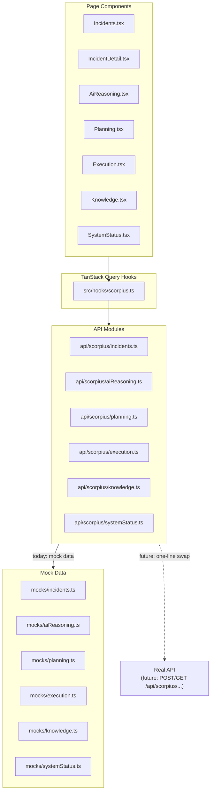

# Epic 12 — Demo Platform & User Experience (Mock Dashboard)

This document covers everything built for **Epic 12** on the `feature/epic-12-mock-dashboard` branch.
It explains what was built, why, how the mock layer works, and exactly what needs to change when real APIs become available.

---

## Table of Contents

1. [Overview](#overview)
2. [Quick Start](#quick-start)
3. [Architecture](#architecture)
4. [New Files Created](#new-files-created)
5. [Pages](#pages)
6. [Mock Data Design](#mock-data-design)
7. [API Contracts](#api-contracts)
8. [TypeScript Types](#typescript-types)
9. [Swapping Mocks for Real APIs](#swapping-mocks-for-real-apis)
10. [What Is Unchanged](#what-is-unchanged)

---

## Overview

Epic 12 extends the existing NetApp Storage Monitoring Dashboard (`destats`) with a new set of **Scorpius platform pages** that visualise the full AI-driven incident remediation workflow:

```
Detect → Reason → Plan → Execute → Learn
```

The upstream APIs for these features were not yet available at development time. Rather than blocking on the backend team, we built a **fully functional mock dashboard** that:

- Is implemented on a dedicated git branch (`feature/epic-12-mock-dashboard`) so `main` is never touched.
- Uses a dedicated `src/mocks/` layer with realistic, NetApp-specific data based on real EMS events already observed in the live cluster.
- Exposes the **exact same function signatures** in `src/api/scorpius/` that the real API client will use — meaning swapping mocks for real calls requires changing only those API modules, with zero changes to any page component or hook.
- Runs entirely locally with `npm run dev` — no VPN, no server, no backend needed.

---

## Quick Start

```bash
# Clone or check out the branch
git checkout feature/epic-12-mock-dashboard

# Install dependencies (skip if already done)
npm install

# Start the dev server
npm run dev
```

Open **http://localhost:5173** in your browser. The new **Scorpius Platform** section appears in the left sidebar.

---

## Architecture

The diagram below shows the data flow from a page component down to the mock layer, and where the real API will plug in when available.



**Key design principle:** Page components and hooks are written exactly as they would be against a real API. The only thing that changes when real APIs arrive is the implementation inside `src/api/scorpius/*.ts`.

---

## New Files Created

```
src/
├── types/
│   └── scorpius.ts          # All TypeScript interfaces for Scorpius API contracts
│
├── mocks/
│   ├── incidents.ts         # 5 realistic incidents based on real EMS events
│   ├── aiReasoning.ts       # AI analysis objects: evidence, knowledge refs, actions
│   ├── planning.ts          # Candidate plans, decision trace, policy checks
│   ├── execution.ts         # Execution runs with per-action terminal output
│   ├── knowledge.ts         # 9 knowledge documents: runbooks, history, use cases
│   └── systemStatus.ts      # Health of 10 Scorpius services
│
├── api/
│   └── scorpius/
│       ├── incidents.ts     # fetchIncidents(), fetchIncidentById(id)
│       ├── aiReasoning.ts   # fetchReasoningForIncident(incidentId)
│       ├── planning.ts      # fetchPlanForIncident(incidentId)
│       ├── execution.ts     # fetchExecutionStatus(id), fetchExecutionHistory()
│       ├── knowledge.ts     # fetchKnowledge(), fetchKnowledgeForIncident(id), searchKnowledge(query)
│       └── systemStatus.ts  # fetchSystemStatus()
│
├── hooks/
│   └── scorpius.ts          # TanStack Query hooks for all Scorpius API modules
│
└── pages/
    ├── Incidents.tsx        # /incidents — incident list with KPI strip
    ├── IncidentDetail.tsx   # /incidents/:id — detail, timeline, sub-tab navigation
    ├── AiReasoning.tsx      # /incidents/:id/reasoning — AI analysis view
    ├── Planning.tsx         # /incidents/:id/planning — plan comparison and decision trace
    ├── Execution.tsx        # /incidents/:id/execution and /execution dashboard
    ├── Knowledge.tsx        # /knowledge — searchable knowledge repository
    └── SystemStatus.tsx     # /system-status — service health grid
```

**Existing files modified:**

| File | Change |
|---|---|
| `src/router.tsx` | Added 6 new routes including nested `incidents/:id/*` |
| `src/components/Sidebar.tsx` | Added "Scorpius Platform" nav section below existing NetApp section |
| `.env.example` | Added `VITE_USE_MOCKS=true` documentation |

---

## Pages

### Incidents — `/incidents`

The entry point for the Scorpius platform. Displays all detected incidents in a card list.

**What is shown:**
- KPI strip: total active, critical count, high count, resolved count
- One card per incident with: severity icon, severity badge, status badge, title, description excerpt, source system, time since creation, affected asset count, tags
- Clicking any card navigates to the Incident Detail page

**Severity levels supported:** critical, high, medium, low, info

---

### Incident Detail — `/incidents/:id`

Master detail view for a single incident.

**What is shown:**
- Incident ID, severity badge, status badge, full title and description
- **Affected Assets** panel: each asset (node, aggregate, volume, SVM, LIF) shown as a chip with type label and detail value
- **Incident Timeline**: chronological event log from detection through to execution, each event tagged with actor type (system / AI / user / policy) and a colour-coded badge
- **Sub-tab navigation** at the bottom: links to AI Reasoning, Planning, and Execution for that incident (child routes rendered via `<Outlet />`)

---

### AI Reasoning — `/incidents/:id/reasoning`

Shows the complete AI analysis generated for the incident.

**What is shown:**
- **Confidence gauge**: large percentage with colour-coded fill bar (green ≥ 80%, yellow ≥ 60%, red below)
- **AI Analysis Summary**: plain-English incident summary paragraph
- **Root Cause Hypothesis**: highlighted violet box with the AI's causal explanation
- **Supporting Evidence**: each data point used by the AI, labelled by type (metric / event / log / historical), with source, summary, value, and relevance score
- **Knowledge References**: documents the AI retrieved from the knowledge base, each with type badge (runbook / incident history / use case / documentation), excerpt, and similarity score
- **Recommended Actions**: ranked numbered list, each with action text, rationale, risk level badge, estimated duration, reversibility indicator, and approval requirement flag
- **Chain-of-Thought Trace**: collapsible panel showing the raw step-by-step reasoning log from the AI model

---

### Planning — `/incidents/:id/planning`

Shows the remediation plan generated by the Scorpius Planner.

**What is shown:**
- Plan ID and generation timestamp; approved-by badge if approved
- **Candidate Plans** grid (2–3 options): each card shows plan name, description, success probability, estimated duration, risk score bar, and numbered step list. The selected plan is highlighted in blue
- **Decision Trace**: step-by-step log of how the planner chose the winning plan, with decision text and rationale for each step
- **Policy Checks**: every organisational policy evaluated, colour-coded by result — approved (green), review required (amber), rejected (red) — with the reason text
- **Estimated Outcome** and **Rollback Strategy** shown side by side at the bottom

---

### Execution — `/incidents/:id/execution` and `/execution`

Two views in one file:

**Per-incident view** (`/incidents/:id/execution`):
- Execution run ID, status badge, start time
- Progress bar: completed / running / failed / pending action counts
- Outcome summary banner (when completed)
- One row per action: rank number, name, description, status badge (with spinner for running), terminal-style output block (dark background, monospace), error block (red), timestamps, duration

**Global Execution Dashboard** (`/execution`):
- KPI strip: total runs, running, completed, failed
- Table of all execution runs across incidents: run ID, incident title, status, action progress (x/y), started time, link to per-incident view

---

### Knowledge — `/knowledge`

Searchable view of the RAG knowledge repository that powers Scorpius AI.

**What is shown:**
- Search input (live search activates at ≥ 2 characters, debounced via TanStack Query `staleTime`)
- Filter chips: All / Runbooks / History / Use Cases / Policies / Documentation (with counts)
- One card per document: type icon, type badge, document ID, category, title, summary, expandable content excerpt, tags, linked incident IDs, last updated time

---

### System Status — `/system-status`

Health dashboard for every service in the Scorpius platform stack.

**What is shown:**
- **Overall health banner**: green / yellow / red with summary counts
- KPI strip: total services, healthy, degraded, down
- One card per service: health dot (green/yellow/red), name, description, health label, uptime, version, service-specific metrics (message queue depth, DB connections, analyses run today, etc.), error message if degraded or down
- The **NetApp Ingestion API** is intentionally shown as degraded, reflecting the real state of the live cluster API at `10.0.65.40:8080`

---

## Mock Data Design

The 5 incidents are based on **real EMS event types already observed** in the live uspdc-nac01 cluster. Each incident has a full mock chain: incident → AI reasoning → plan → execution result.

| Incident | Severity | Scenario | Source Event | Status |
|---|---|---|---|---|
| INC-001 | Critical | `aggr1_n2_nvme` at 91% capacity — volume migration in progress | `wafl.aggr.nearlyFull` | Investigating |
| INC-002 | High | SecD authentication failures on uspdc-nac01-02, AD DNS issue | `secd.unexpectedFailure` | Active (awaiting approval) |
| INC-003 | High | Cluster peer address mismatch, SnapMirror disrupted | `cpeer.addr.warn.host` | Investigating (resolved by execution) |
| INC-004 | Medium | Snapshot policy drift across 12 volumes after migration | Policy compliance scan | Resolved |
| INC-005 | Medium | Volume `uspdc_wvfltdt03` on track to fill in 14 days | Predictive capacity model | Active |

**Why these scenarios?**

They were chosen because:
1. EMS event types `wafl.aggr.nearlyFull`, `secd.unexpectedFailure`, and `cpeer.addr.warn.host` are all present in the live cluster EMS feed already visible on the Events page.
2. They cover the full range of Scorpius capabilities: reactive (EMS-triggered), proactive (predictive capacity), and compliance (snapshot policy).
3. They demonstrate the complete AI workflow chain on at least two incidents — INC-001 (execution running) and INC-003 (execution completed) — making the UI feel live.

**Knowledge documents** (9 total):

| ID | Type | Topic |
|---|---|---|
| KB-001 | Runbook | Aggregate capacity management |
| KB-008 | Runbook | Volume migration checklist |
| KB-015 | Runbook | NVMe to SSD volume migration |
| KB-022 | Runbook | SecD failure troubleshooting |
| KB-031 | Runbook | SnapMirror cluster peer reconfiguration |
| IH-042 | Incident History | aggr1_n1_nvme near-full resolved (March 2026) |
| UC-003 | Use Case | Predictive capacity planning |
| UC-007 | Use Case | Automated aggregate capacity management |
| POL-001 | Policy | Storage operations maintenance window policy |

---

## API Contracts

Every function in `src/api/scorpius/` is listed below with its current mock source and its intended real endpoint.

| Function | File | Returns | Real endpoint (when available) |
|---|---|---|---|
| `fetchIncidents()` | `incidents.ts` | `IncidentListResponse` | `GET /api/scorpius/incidents` |
| `fetchIncidentById(id)` | `incidents.ts` | `Incident \| null` | `GET /api/scorpius/incidents/:id` |
| `fetchReasoningForIncident(id)` | `aiReasoning.ts` | `AiReasoning \| null` | `GET /api/scorpius/incidents/:id/reasoning` |
| `fetchPlanForIncident(id)` | `planning.ts` | `PlanResult \| null` | `GET /api/scorpius/incidents/:id/plan` |
| `fetchExecutionStatus(id)` | `execution.ts` | `ExecutionRun \| null` | `GET /api/scorpius/incidents/:id/execution` |
| `fetchExecutionHistory()` | `execution.ts` | `ExecutionHistoryEntry[]` | `GET /api/scorpius/execution/history` |
| `fetchKnowledge()` | `knowledge.ts` | `KnowledgeResponse` | `GET /api/scorpius/knowledge` |
| `fetchKnowledgeForIncident(id)` | `knowledge.ts` | `KnowledgeDocument[]` | `GET /api/scorpius/knowledge?incident=:id` |
| `searchKnowledge(query)` | `knowledge.ts` | `KnowledgeSearchResponse` | `GET /api/scorpius/knowledge/search?q=:query` |
| `fetchSystemStatus()` | `systemStatus.ts` | `SystemStatusResponse` | `GET /api/scorpius/system/status` |

All functions have a simulated network delay (200–400 ms) so the loading states are visible and the UI behaves realistically.

---

## TypeScript Types

All type definitions live in [`src/types/scorpius.ts`](src/types/scorpius.ts). They are written to match the expected real API contract shapes so there are no surprises when real endpoints arrive.

**Shared types:**

```typescript
type Severity       = 'critical' | 'high' | 'medium' | 'low' | 'info';
type IncidentStatus = 'active' | 'investigating' | 'resolved' | 'suppressed';
type ActionStatus   = 'pending' | 'running' | 'completed' | 'failed' | 'skipped';
type ServiceHealth  = 'healthy' | 'degraded' | 'down' | 'unknown';
type RiskLevel      = 'high' | 'medium' | 'low';
type PolicyDecision = 'approved' | 'rejected' | 'review_required';
```

**Key interfaces (abbreviated):**

| Interface | Key fields |
|---|---|
| `Incident` | id, title, severity, status, source, created_at, assets, timeline, tags, reasoning_id |
| `AiReasoning` | incident_id, confidence_score, risk_level, evidence[], knowledge_references[], recommended_actions[], reasoning_trace |
| `EvidenceItem` | type (metric/event/log/historical), source, summary, value, relevance_score |
| `KnowledgeReference` | id, title, type, excerpt, similarity_score |
| `RecommendedAction` | rank, action, rationale, estimated_risk, estimated_duration_minutes, reversible, requires_approval |
| `PlanResult` | candidate_plans[], selected_plan_id, decision_trace[], policy_checks[], estimated_outcome, rollback_strategy |
| `CandidatePlan` | name, steps[], estimated_duration_minutes, risk_score, success_probability, is_selected |
| `ExecutionRun` | incident_id, plan_id, status, actions[], rollback_triggered, outcome_summary |
| `ExecutionAction` | rank, name, status, output, error, started_at, duration_seconds |
| `KnowledgeDocument` | id, title, type, category, summary, content_excerpt, tags, related_incident_ids |
| `ServiceStatus` | id, name, health, uptime_seconds, version, metrics, error_message |

---

## Swapping Mocks for Real APIs

When a real API endpoint is ready, the **only file that needs to change** is the corresponding module in `src/api/scorpius/`. Pages, hooks, and types stay exactly as they are.

**Example — incidents:**

```typescript
// src/api/scorpius/incidents.ts

// BEFORE (mock):
import { getMockIncidentListResponse } from '../../mocks/incidents';

export async function fetchIncidents(): Promise<IncidentListResponse> {
  await delay(280);
  return getMockIncidentListResponse();
}

// AFTER (real API):
import { apiGet } from '../client';

export async function fetchIncidents(): Promise<IncidentListResponse> {
  return apiGet<IncidentListResponse>('/api/scorpius/incidents');
}
```

The same pattern applies to every other module:

| Module | Mock import to remove | Real call to add |
|---|---|---|
| `aiReasoning.ts` | `getMockReasoning(id)` | `apiGet('/api/scorpius/incidents/:id/reasoning')` |
| `planning.ts` | `getMockPlan(id)` | `apiGet('/api/scorpius/incidents/:id/plan')` |
| `execution.ts` | `getMockExecution(id)` | `apiGet('/api/scorpius/incidents/:id/execution')` |
| `knowledge.ts` | `getMockKnowledgeResponse()` | `apiGet('/api/scorpius/knowledge')` |
| `systemStatus.ts` | `getMockSystemStatus()` | `apiGet('/api/scorpius/system/status')` |

The existing `apiGet<T>` client in [`src/api/client.ts`](src/api/client.ts) handles the API envelope, error handling, and the `/api-proxy` prefix — no additional plumbing needed.

---

## What Is Unchanged

All original NetApp pages are untouched on this branch. No existing file was deleted or had its core logic altered.

| Page | Route | Status |
|---|---|---|
| Overview | `/` | Unchanged |
| Capacity & Efficiency | `/capacity` | Unchanged |
| Aggregates | `/aggregates` | Unchanged |
| Nodes | `/nodes` | Unchanged |
| Network (Interfaces) | `/interfaces` | Unchanged |
| Events (EMS) | `/events` | Unchanged |

The only existing files that were modified are:

- **`src/router.tsx`** — new routes appended; existing routes untouched
- **`src/components/Sidebar.tsx`** — new "Scorpius Platform" nav section added below the existing "NetApp Storage" section; existing links untouched
- **`.env.example`** — one new variable (`VITE_USE_MOCKS`) appended; existing variable untouched

---

## TanStack Query Hooks Reference

All hooks live in [`src/hooks/scorpius.ts`](src/hooks/scorpius.ts) and follow the same pattern as the existing [`src/hooks/queries.ts`](src/hooks/queries.ts).

| Hook | Query key | Auto-refresh |
|---|---|---|
| `useIncidents()` | `['scorpius', 'incidents']` | Yes (global interval) |
| `useIncident(id)` | `['scorpius', 'incident', id]` | Yes |
| `useAiReasoning(id)` | `['scorpius', 'reasoning', id]` | Yes |
| `usePlan(id)` | `['scorpius', 'plan', id]` | Yes |
| `useExecutionStatus(id)` | `['scorpius', 'execution', id]` | Yes |
| `useExecutionHistory()` | `['scorpius', 'execution-history']` | Yes |
| `useKnowledge()` | `['scorpius', 'knowledge']` | Yes |
| `useKnowledgeForIncident(id)` | `['scorpius', 'knowledge', 'incident', id]` | No |
| `useKnowledgeSearch(query)` | `['scorpius', 'knowledge', 'search', query]` | No (10s stale) |
| `useSystemStatus()` | `['scorpius', 'system-status']` | Yes |

The global refresh interval (Off / 15s / 30s / 60s / 5m) from the top-bar selector applies to all auto-refreshing hooks via the existing `RefreshContext`.
