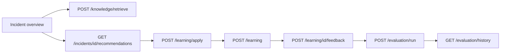

# Platform API → UI map

Single reference for the Scorpius platform APIs wired into destats: **live curl samples**, what each field means, and where they appear in the UI.

| | |
|---|---|
| **Captured** | 2026-07-23 via `curl` against `http://localhost:8088/incident-api` (proxied to TDK gateway) |
| **Browser base** | `/incident-api` |
| **Auth** | none |
| **Legend** | **LIVE** = actual response body from that capture. **DUMMY** = illustrative sample because the live call returned empty / not found — labeled in place. |

```
Browser  →  Nginx :8088 /incident-api/*  →  TDK platform gateway
  (docker-compose INCIDENT_API_TARGET default)
```

Clients: [`src/api/incident-service/`](../src/api/incident-service/)  
Hooks: [`src/hooks/incident-service.ts`](../src/hooks/incident-service.ts), [`src/hooks/platform-api.ts`](../src/hooks/platform-api.ts)

---

## 1. End-to-end journey (one incident)



| Step | API | What you get | UI surface |
|---|---|---|---|
| 1 | `GET /incidents/{id}` | Title, entity, status | Incident header + Overview |
| 2 | `POST /knowledge/retrieve` | Similar docs + `similarity_score` | **Knowledge context** ([`IncidentPlatformPanels`](../src/components/IncidentPlatformPanels.tsx)) |
| 3 | `GET /incidents/{id}/recommendations` | Base recs | Fed into learning apply |
| 4 | `POST /learning/apply` | Re-ranked + `adjusted_confidence` | **Recommendations (learning-adjusted)** |
| 5 | `POST /learning` | New `learning_id` | “Log learning” |
| 6 | `GET /learning/incident/{id}` | Learning rows for incident | **Learning for this incident** |
| 7 | `POST /learning/{id}/feedback` | `success` / `confidence_after` | Success / Failure |
| 8 | `POST /evaluation/run` | `evaluation_id` + metrics | “Run evaluation” |
| 9 | Management pages | Full lists / workflow | `/knowledge`, `/usecases`, `/learning`, `/evaluation` |

**Capture note (2026-07-23):** `GET /incidents` returned **`[]`** on this gateway (all zeros in stats). UUID `e94c2c19-…` returned **not found**. Learning/knowledge/usecases/evaluation data is populated. Demo `INC-*` incidents in the UI still come from client mocks.

---

## 2. Field meanings (quick)

| Domain | Field | Meaning |
|---|---|---|
| Knowledge | `embedding_status` | `completed` = searchable in Milvus |
| Knowledge | `similarity_score` | Semantic match 0–1 (retrieve/similar) |
| Use case | `status` | `Draft` → `Pending Review` → `Approved` |
| Learning | `recommendation_key` | Hash joining stats/rankings/apply |
| Learning | `adjusted_confidence` | Confidence after historical win/loss |
| Learning | `learning_applied` | Whether history changed the score |
| Evaluation | `overall_score` | Aggregate quality 0–1 |
| Evaluation | `metrics[].passed` | Metric vs threshold |

---

## 3. Endpoint catalog (live samples)

### `GET /health` — LIVE

```json
{ "status": "healthy" }
```

| Analysis | Gateway is up. |
| UI | Smoke tests only. |

---

### Incidents

#### `GET /incidents/stats` — LIVE (empty counts)

```json
{
  "total": 0,
  "new": 0,
  "open": 0,
  "investigating": 0,
  "resolved": 0,
  "closed": 0,
  "critical": 0,
  "high": 0,
  "medium": 0,
  "low": 0
}
```

| Analysis | KPI counters for the Incidents page. Today the gateway has **no** incident rows. |
| UI | Incidents KPI tiles (hybrid list still shows demo `INC-*` from mocks). |

#### `GET /incidents` — LIVE (empty)

```json
[]
```

**DUMMY** (what a populated list looks like when the gateway has data):

```json
[
  {
    "incident_id": "e94c2c19-7bc5-4448-ae0b-5b94fb4ff6b9",
    "title": "High latency detected",
    "entity": "node-01",
    "severity": "WARNING",
    "priority": "High",
    "status": "Investigating",
    "alert_count": 1
  }
]
```

| Analysis | Live call returned an empty array. Dummy shows the list-row shape the UI expects. |
| UI | Live rows in Incidents list when present. |

#### `GET /incidents/{id}` — LIVE (not found for sample UUID)

```json
{ "error": "Incident not found" }
```

**DUMMY** (shape when found):

```json
{
  "incident_id": "e94c2c19-7bc5-4448-ae0b-5b94fb4ff6b9",
  "title": "High latency detected",
  "description": "Latency exceeded threshold",
  "entity": "node-01",
  "asset_type": "node",
  "severity": "WARNING",
  "priority": "High",
  "status": "Investigating",
  "correlation_key": "node-01:latency.high:storage_filesystem",
  "related_alert_ids": ["alert-1"]
}
```

| UI | Overview header when a live UUID exists. |

#### `GET /incidents/{id}/timeline` — LIVE (empty)

```json
[]
```

**DUMMY:**

```json
[
  {
    "timestamp": "2026-07-21T12:00:00+00:00",
    "event": "Incident created",
    "details": "Alert correlated"
  }
]
```

#### `GET /incidents/{id}/related` — LIVE (404)

```json
{ "detail": "Not Found" }
```

**DUMMY:**

```json
[
  {
    "incident_id": "…",
    "title": "Related capacity alert",
    "severity": "WARNING",
    "status": "New"
  }
]
```

#### `GET /incidents/{id}/recommendations` — LIVE (404)

```json
{ "detail": "Not Found" }
```

**DUMMY** (shape used by learning-apply input):

```json
[
  {
    "recommendation_id": "rec-1",
    "title": "Expand aggregate capacity",
    "confidence": 0.75,
    "risk": "medium"
  }
]
```

| UI | When live, passed into `POST /learning/apply` in incident panels. |

---

### Use cases

#### `GET /usecases` — LIVE (15 records; first shown)

```json
[
  {
    "id": 1,
    "title": "High Aggregate Utilization",
    "description": "Storage aggregate is approaching capacity limits.",
    "problem": "Aggregate utilization exceeded recommended threshold.",
    "environment": "NetApp ONTAP",
    "trigger_conditions": ["aggregate_used_percent > 90"],
    "historical_incidents": ["INC-1001"],
    "incident_ids": ["INC-1001"],
    "related_usecases": [2],
    "status": "Draft",
    "created_by": "system",
    "approved_by": null,
    "resolution": "Review storage utilization and expand aggregate capacity if necessary.",
    "outcome": "Storage capacity stabilized.",
    "confidence": 0.95,
    "tags": ["aggregate", "capacity", "storage"],
    "category": "Storage Capacity",
    "created_at": "2026-07-20T17:42:09.041632+00:00",
    "updated_at": "2026-07-20T17:42:09.041632+00:00"
  }
]
```

| Analysis | Bare JSON **array** (not wrapped). |
| UI | [`UseCases.tsx`](../src/pages/UseCases.tsx) list. |

#### `GET /usecases/search?q=capacity` — LIVE

```json
{
  "ok": true,
  "returned_records": 14,
  "records": [ { "id": 1, "title": "High Aggregate Utilization", "status": "Draft" } ]
}
```

| Analysis | Search is **wrapped** (`records`), unlike list. Client normalizes both. |
| UI | Use Cases search box (≥2 chars). |

#### `GET /usecases/{id}` — LIVE (`id=1`)

Same object shape as list item (full fields). Detail pane on Use Cases page.

#### `GET /usecases/{id}/versions` — LIVE (empty)

```json
{
  "ok": true,
  "usecase_id": 1,
  "returned_records": 0,
  "records": []
}
```

**DUMMY:**

```json
{
  "ok": true,
  "usecase_id": 1,
  "returned_records": 1,
  "records": [
    {
      "version": 1,
      "status": "Draft",
      "updated_at": "2026-07-20T17:42:09+00:00"
    }
  ]
}
```

#### `GET /usecases/{id}/incidents` — LIVE (empty history)

```json
{
  "ok": true,
  "usecase_id": 1,
  "historical_incidents": []
}
```

**DUMMY:**

```json
{
  "ok": true,
  "usecase_id": 1,
  "historical_incidents": ["INC-1001", "INC-1003"]
}
```

#### `GET /usecases/{id}/related` — LIVE

```json
{
  "ok": true,
  "usecase_id": 1,
  "returned_records": 1,
  "records": [
    {
      "id": 2,
      "title": "Critical EMS Event",
      "status": "Draft",
      "category": "EMS"
    }
  ]
}
```

#### Writes (verified earlier in smoke; not re-posted in this capture)

| Method | Path | Effect |
|---|---|---|
| `POST` | `/usecases` | Creates draft; returns full object with numeric `id` |
| `PATCH` | `/usecases/{id}` | Updates fields |
| `PATCH` | `/usecases/{id}/submit` | → `Pending Review` |
| `PATCH` | `/usecases/{id}/approve` | → `Approved`, sets `approved_by` |

---

### Knowledge

#### `GET /knowledge` — LIVE (20 items; first shown)

```json
[
  {
    "id": 19,
    "title": "usman-smoke-kn-20260721T135625Z",
    "document_type": null,
    "source": null,
    "content": "Smoke knowledge about NetApp aggregate capacity thresholds.",
    "tags": ["smoke-test"],
    "related_usecase_ids": [],
    "embedding_status": "completed",
    "parent_document_id": null,
    "chunk_index": null,
    "chunk_count": null,
    "created_at": "2026-07-21T13:56:28.415504+00:00",
    "updated_at": "2026-07-21T13:56:34.315778+00:00"
  }
]
```

| Analysis | Bare array. UI maps to `KnowledgeDocument` (`id` → string, `content` → excerpt). |
| UI | [`Knowledge.tsx`](../src/pages/Knowledge.tsx). |

#### `GET /knowledge/search?q=capacity` — LIVE

```json
{
  "ok": true,
  "returned_records": 20,
  "records": [ { "id": 19, "title": "usman-smoke-kn-…", "embedding_status": "completed" } ]
}
```

| Analysis | Wrapped `records` (same as use-case search). |

#### `GET /knowledge/{id}` — LIVE (`id=19`)

Same shape as list item.

#### `POST /knowledge/retrieve` — LIVE

Request: `{"query":"aggregate utilization exceeded threshold","limit":3}`

```json
{
  "ok": true,
  "retrieval_type": "semantic_context_package",
  "query": "aggregate utilization exceeded threshold",
  "semantic_search": {
    "ok": true,
    "retrieval_type": "semantic",
    "provider": "sentence_transformers",
    "model": "sentence-transformers/all-MiniLM-L6-v2",
    "collection_name": "knowledge_items_minilm_v1",
    "returned_records": 3,
    "records": [
      {
        "id": 15,
        "title": "usman-smoke-kn-20260721T135139Z",
        "content": "Smoke knowledge about NetApp aggregate capacity thresholds.",
        "tags": ["smoke-test"],
        "embedding_status": "completed",
        "similarity_score": 0.5143874287605286
      }
    ]
  }
}
```

| Analysis | RAG package; records live under `semantic_search.records`. |
| UI | Knowledge context on Overview / Reasoning. |

#### `POST /knowledge/similar` — LIVE

```json
{
  "ok": true,
  "query": "storage capacity",
  "retrieval_type": "semantic",
  "provider": "sentence_transformers",
  "model": "sentence-transformers/all-MiniLM-L6-v2",
  "collection_name": "knowledge_items_minilm_v1",
  "returned_records": 3,
  "records": [
    {
      "id": 5,
      "title": "usman-smoke-knowledge-20260721T125859Z",
      "content": "Smoke test knowledge document about aggregate capacity.",
      "similarity_score": 0.27850791811943054,
      "embedding_status": "completed"
    }
  ]
}
```

---

### Learning

#### `GET /learning` — LIVE (15 records; first shown)

```json
{
  "ok": true,
  "returned_records": 15,
  "records": [
    {
      "id": 15,
      "learning_id": "LRN-B82AA36043BE",
      "incident_id": "INC-SMOKE-20260721T135625Z",
      "usecase_id": 1,
      "knowledge_id": null,
      "recommendation": "Smoke expand capacity",
      "recommendation_key": "951f181022db79d7cb9f8119b43b2158",
      "outcome_status": "success",
      "success": true,
      "confidence_after": 0.875,
      "created_at": "2026-07-21T13:56:30.381414+00:00",
      "updated_at": "2026-07-21T13:56:35.567984+00:00"
    }
  ]
}
```

| UI | [`Learning.tsx`](../src/pages/Learning.tsx). |

#### `GET /learning/{learning_id}` — LIVE

```json
{
  "ok": true,
  "learning_record": {
    "learning_id": "LRN-B82AA36043BE",
    "incident_id": "INC-SMOKE-20260721T135625Z",
    "recommendation": "Smoke expand capacity",
    "outcome_status": "success",
    "success": true,
    "confidence_after": 0.875
  }
}
```

#### `GET /learning/stats` — LIVE

```json
{
  "ok": true,
  "stats": [
    {
      "recommendation_key": "951f181022db79d7cb9f8119b43b2158",
      "recommendation": "Smoke expand capacity",
      "total_attempts": 6,
      "success_count": 6,
      "failure_count": 0,
      "success_rate": 1.0,
      "confidence_score": 0.875,
      "last_outcome": "success",
      "last_incident_id": "INC-SMOKE-20260721T135625Z"
    }
  ]
}
```

#### `GET /learning/rankings` — LIVE

```json
{
  "ok": true,
  "returned_records": 3,
  "rankings": [
    {
      "recommendation_key": "951f181022db79d7cb9f8119b43b2158",
      "recommendation": "Smoke expand capacity",
      "success_rate": 1.0,
      "confidence_score": 0.875
    }
  ]
}
```

#### `GET /learning/incident/{incident_id}` 

**LIVE — UUID sample (empty):**

```json
{
  "ok": true,
  "incident_id": "e94c2c19-7bc5-4448-ae0b-5b94fb4ff6b9",
  "returned_records": 0,
  "records": []
}
```

**LIVE — smoke incident (has data):**

```json
{
  "ok": true,
  "incident_id": "INC-SMOKE-20260721T135625Z",
  "returned_records": 1,
  "records": [
    {
      "learning_id": "LRN-B82AA36043BE",
      "recommendation": "Smoke expand capacity",
      "outcome_status": "success",
      "success": true,
      "confidence_after": 0.875
    }
  ]
}
```

| UI | Incident learning strip; empty for UUID until learning is logged against that id. |

#### `POST /learning/apply` — LIVE

Request: two recommendations with confidences `0.75` / `0.65`.

```json
{
  "ok": true,
  "returned_records": 2,
  "recommendations": [
    {
      "recommendation": "Review storage utilization",
      "confidence": 0.65,
      "recommendation_key": "39b0c97469a638d2168bb660beca8705",
      "historical_attempts": 0,
      "historical_success_rate": 0.0,
      "adjusted_confidence": 0.65,
      "learning_applied": false,
      "rank": 1
    },
    {
      "recommendation": "Expand aggregate capacity and verify utilization",
      "confidence": 0.75,
      "historical_attempts": 2,
      "historical_success_rate": 0.5,
      "adjusted_confidence": 0.5,
      "learning_applied": true,
      "rank": 2
    }
  ]
}
```

| Analysis | History can **lower** confidence and change rank (`learning_applied: true`). |
| UI | Learning-adjusted recommendations panel. |

#### `POST /learning` / `POST /learning/{id}/feedback`

Verified in write smoke (not re-run here). Feedback body **must** include `"success": true|false`.

**DUMMY feedback response:**

```json
{
  "ok": true,
  "learning_record": {
    "learning_id": "LRN-B82AA36043BE",
    "outcome_status": "success",
    "success": true,
    "confidence_after": 0.875
  }
}
```

---

### Evaluation

#### `GET /evaluation` — LIVE (summary only — no rows)

```json
{
  "ok": true,
  "summary": {
    "total_evaluations": 14,
    "completed_evaluations": 14,
    "failed_evaluations": 0,
    "average_overall_score": 0.8064,
    "average_recommendation_quality": 0.8480642857142857,
    "average_retrieval_quality": 0.7714285714285715,
    "average_resolution_success": 0.9285714285714286,
    "average_response_time_ms": 436.42857142857144,
    "metric_count": 140
  }
}
```

| Analysis | Aggregates only. UI list uses **history**. |

#### `GET /evaluation/history` — LIVE

```json
{
  "ok": true,
  "returned_records": 14,
  "records": [
    {
      "id": 14,
      "evaluation_id": "EVAL-42FE3FC19E44",
      "incident_id": "INC-1001",
      "learning_id": "LRN-749118C28398",
      "recommendation_key": "5281be162fbea57cd05b96a86cbdf4bb",
      "evaluation_type": "learning_outcome",
      "status": "completed",
      "overall_score": 0.8532,
      "response_time_ms": 420.0,
      "created_by": "usman-smoke",
      "created_at": "2026-07-21T13:56:27.130214+00:00"
    }
  ]
}
```

| UI | [`Evaluation.tsx`](../src/pages/Evaluation.tsx). |

#### `GET /evaluation/{evaluation_id}` — LIVE (`EVAL-42FE3FC19E44`)

Wrapped as `{ ok, evaluation: { …, metrics: […] } }` with per-metric `passed` / `threshold`.

#### `POST /evaluation/run` — LIVE (this capture)

Request used `learning_id=LRN-B82AA36043BE`.

```json
{
  "ok": true,
  "evaluation": {
    "evaluation_id": "EVAL-1155408B4666",
    "incident_id": "INC-SMOKE-20260721T135625Z",
    "learning_id": "LRN-B82AA36043BE",
    "evaluation_type": "learning_outcome",
    "status": "completed",
    "overall_score": 0.8678,
    "response_time_ms": 420.0,
    "created_by": "doc-sample",
    "metrics": [
      {
        "metric_id": "MET-113D9CD06581",
        "metric_name": "resolution_success",
        "metric_value": 1.0,
        "threshold": 1.0,
        "passed": true
      }
    ]
  }
}
```

| UI | Run form on Evaluation page; Run evaluation on incident panels. |

---

## 4. Empty / error summary from this capture

| Endpoint | Live result | Doc treatment |
|---|---|---|
| `GET /incidents` | `[]` | LIVE empty + **DUMMY** list shape |
| `GET /incidents/stats` | all zeros | LIVE |
| `GET /incidents/{uuid}` | `Incident not found` | LIVE + **DUMMY** detail |
| `…/timeline` | `[]` | LIVE empty + **DUMMY** |
| `…/related`, `…/recommendations` | `404 Not Found` | LIVE + **DUMMY** |
| `GET /learning/incident/{uuid}` | `records: []` | LIVE empty; smoke id has data |
| `GET /usecases/{id}/versions` | `records: []` | LIVE empty + **DUMMY** |
| `GET /usecases/{id}/incidents` | `historical_incidents: []` | LIVE empty + **DUMMY** |

Everything else in §3 marked **LIVE** was returned non-empty HTTP 200 JSON.

---

## 5. UI route checklist

| Route | Primary APIs |
|---|---|
| `/incidents` | `/incidents`, `/incidents/stats` (+ demo mocks) |
| `/incidents/:id/overview` | detail/timeline/related + platform panels |
| `/incidents/:id/reasoning` | demo mocks **or** platform panels for UUID |
| `/knowledge` | `/knowledge`, `/knowledge/search` |
| `/usecases` | `/usecases`, search, create/submit/approve |
| `/learning` | `/learning`, stats, rankings, feedback |
| `/evaluation` | `/evaluation/history`, `/evaluation/run` |
| `/api-docs` | In-app browser; this file is the analysis |

---

## 6. Re-capture

```bash
BASE=http://localhost:8088/incident-api   # or http://10.0.65.19:8088/incident-api
curl -sS "$BASE/health" | python3 -m json.tool
curl -sS "$BASE/usecases" | python3 -m json.tool | head
curl -sS "$BASE/learning" | python3 -m json.tool | head
curl -sS "$BASE/evaluation/history" | python3 -m json.tool | head
curl -sS -X POST "$BASE/knowledge/retrieve" \
  -H 'Content-Type: application/json' \
  -d '{"query":"aggregate utilization exceeded threshold","limit":3}' | python3 -m json.tool | head
```

Smoke suites: `bash scripts/test-epic-apis.sh`, `bash scripts/test-epic-writes.sh`.  
Prior pass/fail report: [EPIC_4_5_10_11_API_TEST_REPORT.md](./EPIC_4_5_10_11_API_TEST_REPORT.md).
